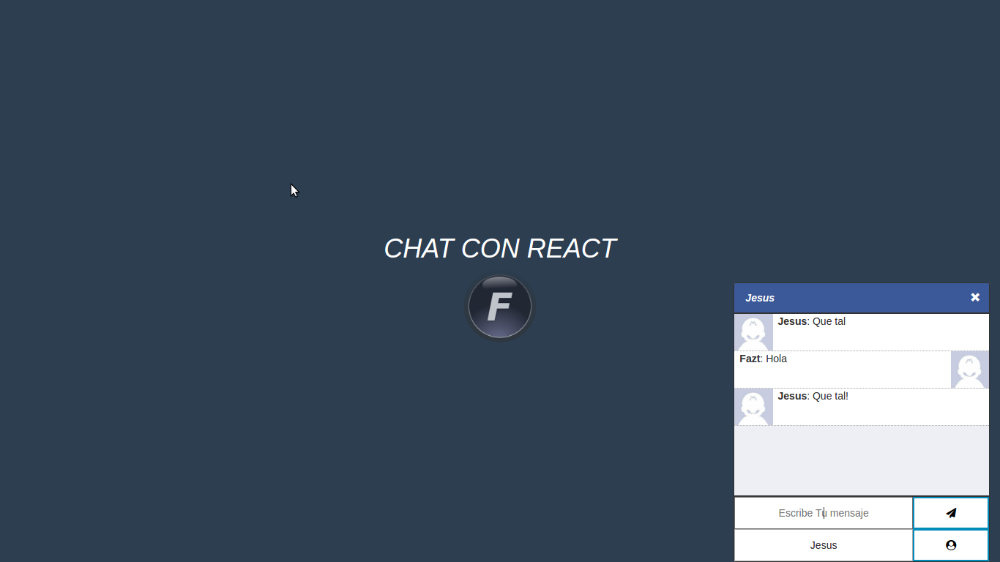

# Chat con React

Chat básico en tiempo real construido con **React 19 + Vite** en el cliente y **Express 5 + Socket.io 4** en el servidor.



## Stack

| Capa     | Tecnología                                |
| -------- | ----------------------------------------- |
| Cliente  | React 19, Vite 8, socket.io-client 4      |
| Servidor | Node.js, Express 5, Socket.io 4 (ESM)     |
| UI       | Bootstrap 5 (CDN), Font Awesome 6 (CDN)   |

## Estructura

```
chat_react_tutorial/
├── client/                # SPA con Vite + React
│   ├── index.html
│   ├── vite.config.js
│   ├── public/img/
│   └── src/
│       ├── main.jsx
│       ├── App.jsx
│       └── style.css
├── server/                # API Express + Socket.io
│   ├── server.js
│   └── package.json
└── package.json           # Scripts orquestados con concurrently
```

## Requisitos

- Node.js 22 o superior

## Instalación

```bash
git clone https://github.com/fazt/chat_react_tutorial
cd chat_react_tutorial
npm run install:all
```

`install:all` instala las dependencias en la raíz, en `server/` y en `client/`.

## Desarrollo

```bash
npm run dev
```

Esto levanta:

- **Servidor** (Socket.io + Express): http://localhost:3000
- **Cliente** (Vite, HMR): http://localhost:5173

Abre dos pestañas en `http://localhost:5173`, define un nombre de usuario en cada una, y envía mensajes para verlos llegar en tiempo real a ambos clientes.

## Producción

Para construir el cliente y servir solo el backend:

```bash
npm run build         # genera client/dist
npm run start         # arranca server/server.js
```

(Para servir `client/dist` desde Express necesitarías añadir `app.use(express.static(...))` apuntando a esa carpeta — queda como ejercicio para extender el tutorial.)

## Eventos Socket.io

| Evento          | Dirección       | Payload                       |
| --------------- | --------------- | ----------------------------- |
| `chat:message`  | client → server | `{ usuario, texto }`          |
| `chat:message`  | server → client | `{ usuario, texto }` (broadcast) |

## Variables de entorno

`client/.env` (opcional):

```
VITE_SERVER_URL=http://localhost:3000
```

## Autor

- Web: https://faztweb.com
- Twitter / X: https://twitter.com/fazttech
