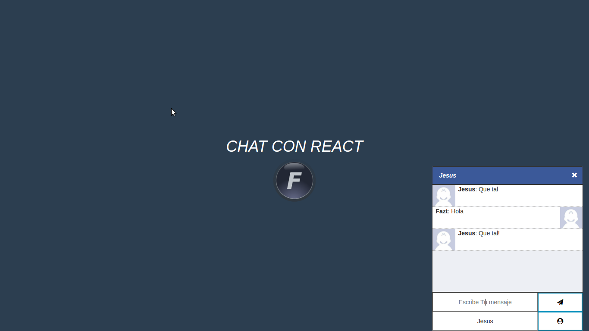

## El proyecto Luce Así

#Instalación del Proyecto
- cd chat_react_tutorial
- `npm install && npm run dev`

## Definir estructura del proyecto
1. estructura del FrontEnd
  - crear package.json
  - crear directorio public
    - crear index.html
2. crear servidor http con express y socket.io
  - crear archivo server.js
  - `npm install express --save`
  - `npm install socket.io --save`
  - crear servidor http y sockets

3. instalar React:
  - crear carpeta src
    - crear archivo app.jsx
  - instalar webpack
  - instalar react, react-dom
  - instalar babel-core babel-loader babel-preset-react babel-preset-es2015
  - definir los loaders para .jsx y .js
  - crear .babelrc
  - usar bundle.js en index.html
